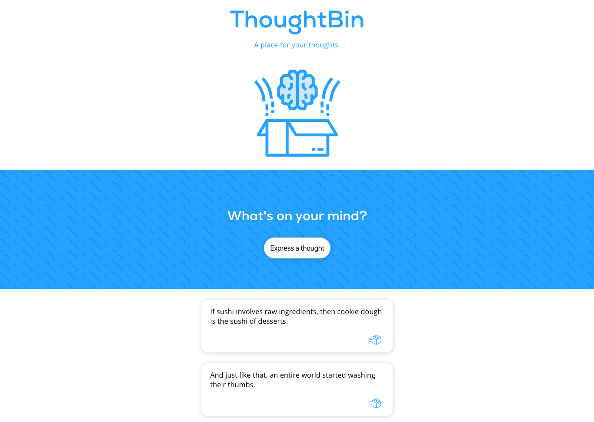
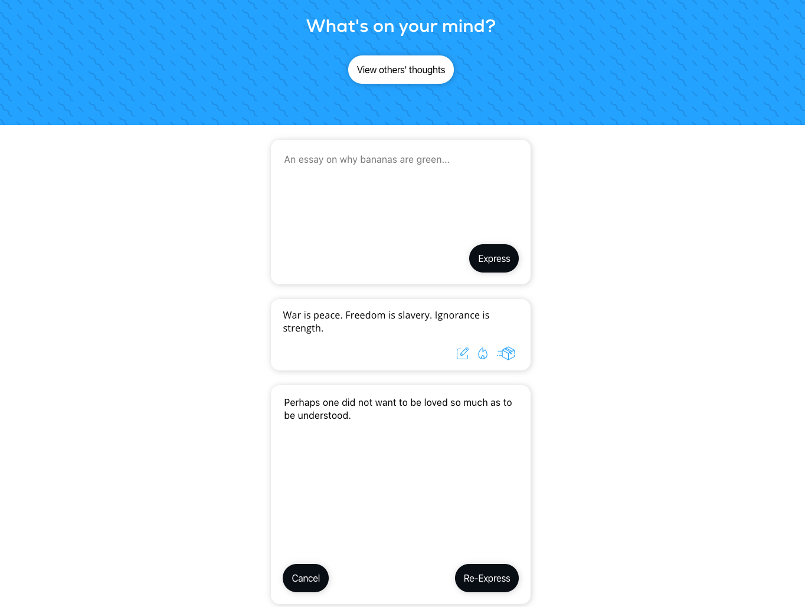

# ThoughtBin

ThoughtBin allows users to anonymously share and create content on a simple and frictionless micro-platform. Think of it as a privacy-centric Twitter with a hint of 4Chan. A live demo can be found at [https://thoughtbin.imdan.io/](https://thoughtbin.imdan.io/)

## Motivation

I wanted a social media network where I didn't have to worry about followers, likes, or reputation. I felt there was a need to create something that respected the user and fostered a safe space for self-expression. Soon after, the idea of ThoughtBin was born. 

ThoughtBin's basic principles:

* Disseminating information shouldn’t be difficult
* Publishing new information should not require you to surrender your identity
* Access to information should not be gated by identification
* Every internet user should have the ability to *anonymously* share/create content; *pseudonymity* is not acceptable.

By design, ThoughtBin only stores a single token in Local Storage to authenticate and fetch your personal thoughts. No trackers, no cookies, nothing else.

## ThoughtBot

The live demo includes an automated posting bot that scrapes r/ShowerThoughts to feign user interaction and show off the WebSocket functionality + infinite scroll features. Here is the repository for [ThoughtBot](https://github.com/dannydi12/thoughtbin-bot).

## Installation

#### `npm install`

Installs all the required dependencies. Run this before anything else.

#### `npm start`

Runs the app in the development mode  
Open  [http://localhost:3000](http://localhost:3000/)  to view it in the browser.

The page will reload if you make edits.  
You will also see any lint errors in the console.

#### `npm test`

Launches the test runner in the interactive watch mode.  

## Configuration

Make sure to go to `[thoughtbin-folder-name]/src/config.js` and enter the proper URLs for the Express and Websocket server. 

### **The backend repository can be found [here](https://github.com/dannydi12/thoughtbin-server).**

## Screenshots
Landing Page:

Personal Thoughts Page:

## Built With

#### Front-end:

* React
* HTML5
* CSS3
* Javascript
* JSON Web Token
* Websockets
* Jest
* Deployed with Zeit

#### Back-end:

* Node
* PostgreSQL
* Knex
* JSON Web Token
* Websockets
* Express
* Mocha, and Chai
* Deployed with Heroku

## Demo

- [Live Demo](https://thoughtbin.imdan.io/)

## Authors

* **Daniel DiVenere** - Fullstack Development, Deployment, etc - [https://imdan.io/](https://imdan.io/)